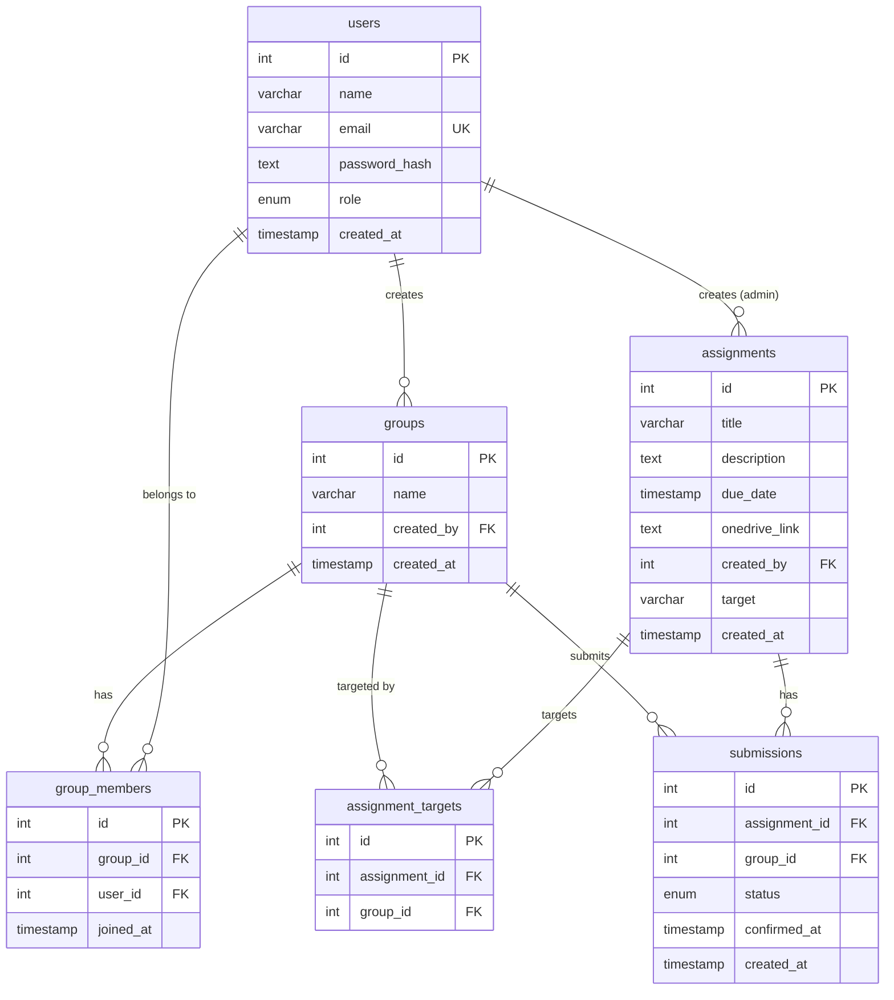

# Joineazy — Student, Group & Assignment Management System

Joineazy is a comprehensive web application designed to streamline student group formations and assignment tracking. It provides a dual-role interface:
- **Students** can form groups, view assignments targeted to them, and confirm their submissions via a two-step process.
- **Professors (Admins)** can create assignments targeting all or specific groups, track real-time submission progress, and accept/reject student work.

**Stack:** React.js + Tailwind CSS · Node.js + Express · PostgreSQL · Docker · JWT Auth

---

## 🏗 Architecture Overview

The system is built as a modern, decoupled monolith using a standard three-tier architecture:

1. **Frontend (Client):** Single Page Application built with React, Vite, and Tailwind CSS. It communicates with the backend via RESTful APIs and uses Axios with interceptors for global JWT error handling.
2. **Backend (API):** Node.js and Express server. It handles business logic, JWT authentication, and role-based access control.
3. **Database:** PostgreSQL database. Data is queried using the `pg` client directly (raw SQL) to optimize performance and ensure transparent queries.

---

## 🚀 Quick Start (Docker - Recommended)

The entire application (Frontend, Backend, and Database) is containerized and orchestrated using Docker Compose.

```bash
# 1. Clone the repository
git clone <repo-url>
cd Joineazy-task1

# 2. Copy the environment variables template
cp backend/.env.example backend/.env

# 3. Boot the full stack (this will build the frontend and backend images)
docker-compose up --build
```

- **Frontend UI:** [http://localhost:3000](http://localhost:3000)
- **Backend API:** [http://localhost:5000](http://localhost:5000)
- **PostgreSQL:** `localhost:5432`

---

## 🛠 Local Development (Without Docker)

If you prefer to run the services directly on your host machine:

### 1. Database Setup
Ensure you have a PostgreSQL instance running locally. Create a database (e.g., `joineazy_db`) and update the `backend/.env` file with your credentials.

### 2. Backend
```bash
cd backend
npm install
cp .env.example .env   # Fill in DB credentials and JWT secret
npm run dev
```

### 3. Frontend
```bash
cd frontend
npm install
npm run dev
```
The frontend will run at [http://localhost:5173](http://localhost:5173).

---

## 🌱 Seeding Demo Data

To populate the database with demo users, groups, assignments, and submissions, run the seed script from the `backend` directory (ensure the database is running):

```bash
cd backend
npm run seed
```

**Demo Accounts Created (Password for all is `password123`):**
- **Admins:** `prof.smith@university.edu`, `prof.jones@university.edu`
- **Students:** `alice@university.edu`, `bob@university.edu`, `charlie@university.edu`, `diana@university.edu`, `eve@university.edu`, `frank@university.edu`

---

## 🧱 Database Schema



---

## 📡 API Endpoint Reference

All protected routes require a JWT token in the `Authorization` header (`Bearer <token>`).

### Auth (`/auth`)
| Method | Path | Auth | Description |
|---|---|---|---|
| POST | `/register` | Public | Register a new student or admin |
| POST | `/login` | Public | Login with email and password |
| POST | `/google` | Public | Login via Google OAuth |

### Groups (`/groups`)
| Method | Path | Auth | Description |
|---|---|---|---|
| POST | `/` | Student | Create a new group |
| GET | `/mine` | Student | Get current student's group and members |
| POST | `/leave` | Student | Leave the current group |
| POST | `/:id/members` | Student | Add a member to the group by email |
| DELETE | `/:id/members/:userId` | Student | Remove a member from the group |

### Assignments (`/assignments`)
| Method | Path | Auth | Description |
|---|---|---|---|
| GET | `/groups` | Admin | List all groups (used for targeting) |
| POST | `/` | Admin | Create a new assignment |
| GET | `/` | Admin | Get all assignments |
| GET | `/:id` | Admin | Get a single assignment |
| PUT | `/:id` | Admin | Update an assignment |
| DELETE | `/:id` | Admin | Delete an assignment |

### Submissions (`/submissions`)
| Method | Path | Auth | Description |
|---|---|---|---|
| GET | `/my-assignments` | Student | Get assignments assigned to the student's group |
| POST | `/:assignmentId/confirm-step1` | Student | Step 1 confirmation (submit link) |
| POST | `/:assignmentId/confirm-final` | Student | Final confirmation |

### Analytics (`/analytics`)
| Method | Path | Auth | Description |
|---|---|---|---|
| GET | `/summary` | Admin | Get overall platform statistics |
| GET | `/assignments/:id/status` | Admin | Get group submission status for a specific assignment |
| PUT | `/assignments/:id/groups/:groupId/accept` | Admin | Accept a group's submission |
| PUT | `/assignments/:id/groups/:groupId/reject` | Admin | Reject a group's submission |

---

## ⚖️ Key Design & Deployment Decisions

1. **Raw SQL over ORM:** Used `pg` directly to allow for maximum transparency and control over complex JOINs (especially for analytics and group targeting).
2. **Stateless JWT Auth:** Chosen over session-based auth to decouple the frontend from the backend, making the API truly RESTful and easier to scale.
3. **Multi-stage Docker Builds:** The frontend uses a multi-stage Dockerfile that builds the Vite application and serves the static assets using an optimized Nginx server, resulting in a tiny, production-ready image.
4. **Relational Integrity:** Extensive use of PostgreSQL foreign keys and `ON DELETE CASCADE` constraints ensures orphaned records are never left behind (e.g., deleting a group automatically removes its members and submissions).
5. **Tailwind CSS Glassmorphism:** Chose a modern, highly responsive design system utilizing backdrop filters and smooth CSS transitions to provide a premium user experience without relying on heavy external UI libraries.

---

## 📖 Additional Documentation
- [Build Phases](./docs/phases.md)
- [Development Journal](./learn.md)