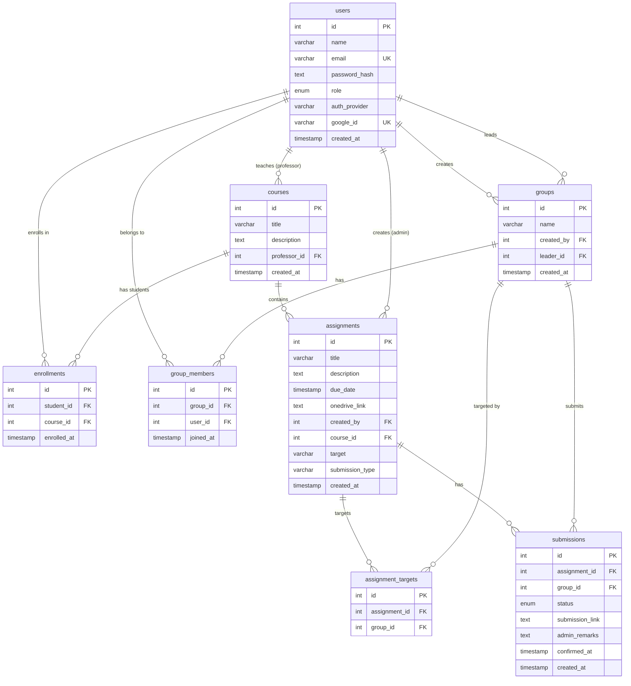

# Joineazy — ER Diagram

> Rendered with [Mermaid](https://mermaid.js.org/). Paste into GitHub or [mermaid.live](https://mermaid.live) to view.



---

## Relationships Summary

| Relationship | Type | Description |
|---|---|---|
| `users` → `courses` | 1-to-many | A professor creates/teaches courses |
| `users` ↔ `courses` via `enrollments` | many-to-many | Students enroll in courses |
| `courses` → `assignments` | 1-to-many | A course contains multiple assignments |
| `users` → `groups` | 1-to-many | A user (student) creates a group |
| `users` → `groups` (leader_id) | 1-to-many | A user is designated as group leader |
| `users` ↔ `groups` via `group_members` | many-to-many | Users belong to groups |
| `users` → `assignments` | 1-to-many | An admin creates assignments |
| `assignments` ↔ `groups` via `assignment_targets` | many-to-many | Assignment assigned to specific groups |
| `assignments` ↔ `groups` via `submissions` | many-to-many | One submission record per group per assignment |

---

## Submission Status Flow

```
pending  ──▶  step1_confirmed  ──▶  confirmed  ──▶  accepted
   (default)    (student clicks      (student confirms   (admin reviews
                 "I've submitted")    in the modal)       and accepts)
                                          │
                                          └──▶  rejected
                                               (admin rejects)
```

---

## Assignment Types (Round 2)

| Type | `submission_type` | Acknowledgment Rule |
|---|---|---|
| Group | `'group'` | Only the group **leader** can acknowledge; propagates to all members |
| Individual | `'individual'` | Each student acknowledges their own submission independently |
