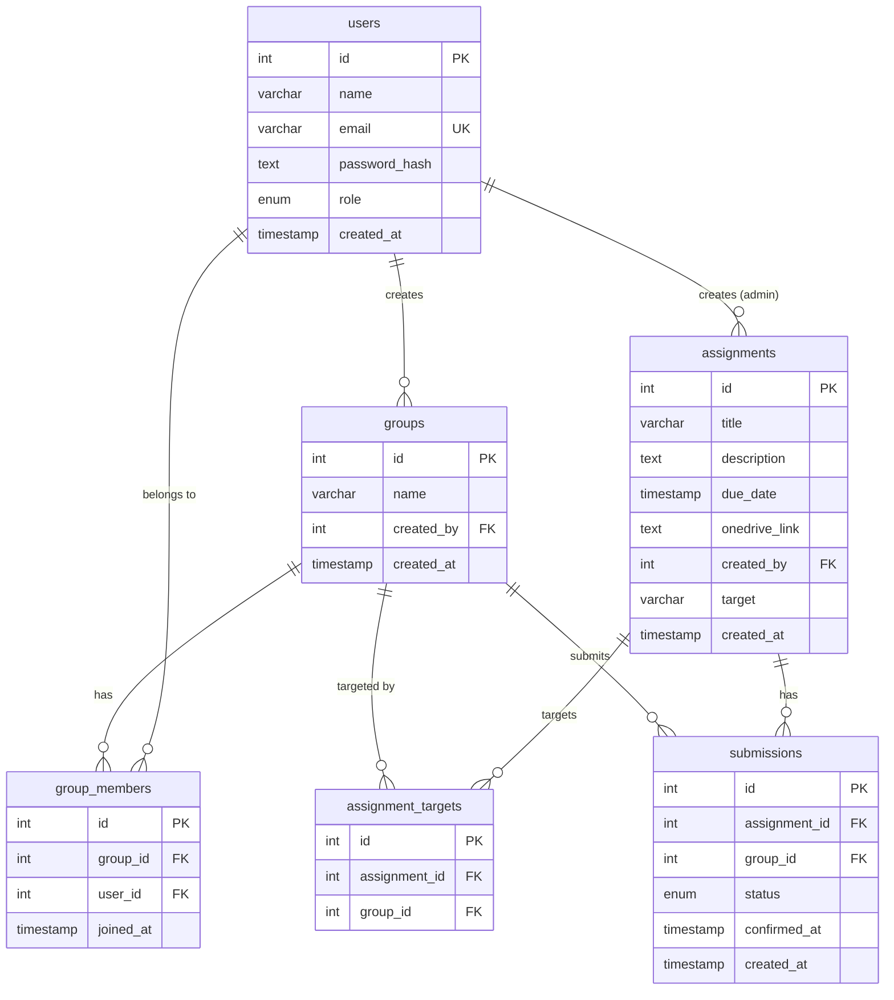

# Joineazy — ER Diagram

> Rendered with [Mermaid](https://mermaid.js.org/). Paste into GitHub or [mermaid.live](https://mermaid.live) to view.



---

## Relationships Summary

| Relationship | Type | Description |
|---|---|---|
| `users` → `groups` | 1-to-many | A user (student) creates a group |
| `users` ↔ `groups` via `group_members` | many-to-many | Users belong to groups |
| `users` → `assignments` | 1-to-many | An admin creates assignments |
| `assignments` ↔ `groups` via `assignment_targets` | many-to-many | Assignment assigned to specific groups |
| `assignments` ↔ `groups` via `submissions` | many-to-many | One submission record per group per assignment |

---

## Submission Status Flow

```
pending  ──▶  step1_confirmed  ──▶  confirmed
   (default)    (student clicks      (student confirms
                 "I've submitted")    in the modal)
```
